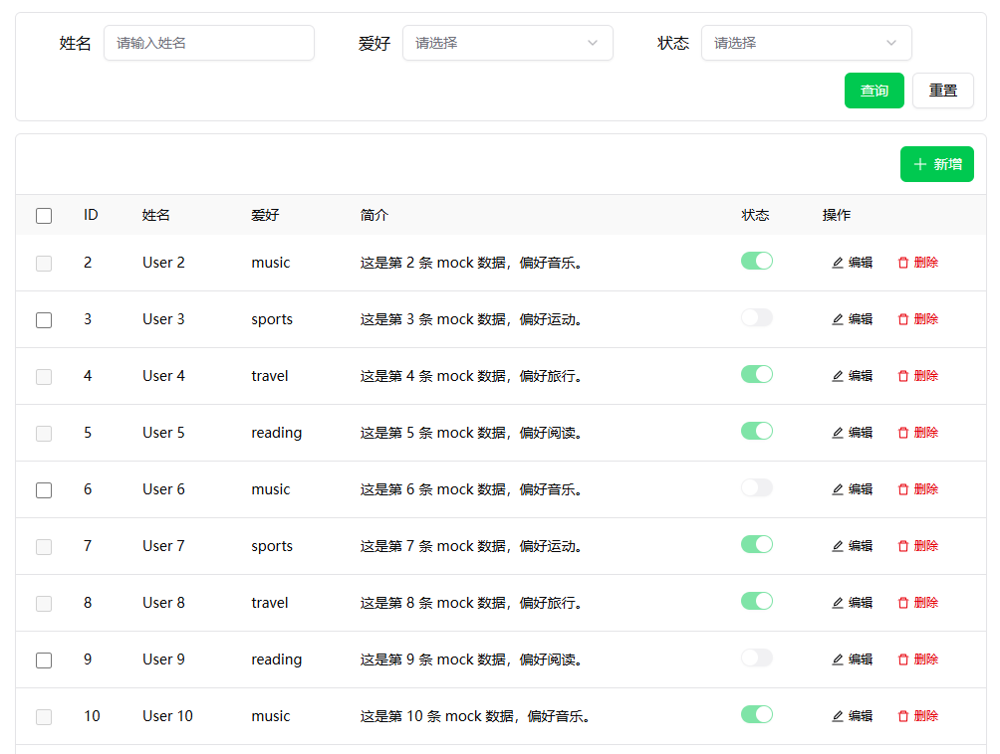

<div align="center">


</div>

# pooka-admin

> A fully controllable admin toolkit designed for frontend developers.

## Features

### UI 自主可控

组件以 **shadcn-vue（copy-paste）** 为基础，样式由 **UnoCSS** 驱动；通过 `@pooka/ui` 的 **`presetPooka`** 选择 **主题 token**，在原子类与语义色之间统一主色与组件观感，无需自己拼多套 CSS 变量。

Playground 示例（[`apps/playground/uno.config.ts`](./apps/playground/uno.config.ts)）：

```ts
import { defineConfig } from 'unocss';
import { presetPooka } from '@pooka/ui/preset';

export default defineConfig({
  presets: presetPooka({ theme: 'antd' }),
});
```

**`presetPooka` 的主题 token** 由 `theme` 三选一，含义如下（实现见 [`packages/ui/src/preset.ts`](./packages/ui/src/preset.ts)）。

| `theme` | 作用 |
| --- | --- |
| `'antd'` | **Ant Design** 主色体系（默认主色 `#1677ff`），适合希望后台整体贴近 Ant 蓝与相关 token 的项目。 |
| `'element'` | **Element Plus** 主色体系（默认主色 `#409eff`），适合贴近 Element 蓝与相关 token 的项目。 |
| `'shadcn'` | **纯 shadcn** 语义色与内置色板（默认主色走 shadcn 内置 `green`），不叠加 Ant/Element 的主色预设。 |

可选 **`options`**：`primary` 覆盖上述默认主色（shadcn 内置色名或 hex）；`icon` / `presetIcons` 控制图标集合（如 Ant Design 图标与 safelist 中的 `i-ant-design-*`）。菜单等 **运行时拼接的图标类名** 仍需在应用 `uno.config` 里 **safelist**，否则 Uno 不会生成对应样式。

### 开箱即用

#### CRUD

内置 `Crud` 增删改查组件，基于 `@pooka/core` + `@pooka/ui`，可通过配置快速组装：

- 表格列配置：`columns`（支持文本、选择、开关等展示）
- 查询区配置：`search`（input/select/switch）
- 表单配置：`form.fields`（新增/编辑统一 schema）
- 行选择能力：`tableProps.rowSelection`（多选、禁选、批量删除）

完整示例见 `apps/playground/src/views/HomeView.vue`，核心用法如下：

```ts
const crudOptions: UseCrudOptions<UserRow, UserRow> = {
  api: '/api/user',
  columns: [...],
  search: [...],
  form: { fields: [...] },
  tableProps: {
    rowSelection: {
      enabled: true,
      mode: 'multiple',
      disableRowWhen: (row) => row.status === true,
    },
  },
}
```

Playground 效果图：



### 动态路由权限（accessRouter）

`@pooka/core` 提供 **accessRouter**：在「登录态 + 角色/权限码」下过滤后端或前端下发的路由，并派生侧边栏菜单；在路由守卫里调用 `guard` 即可完成未登录跳转登录、无权限跳转 403。Playground 演示：`apps/playground/src/access/access-router.ts`、`apps/playground/src/router/index.ts`。

**1. 注册运行时与 accessRouter**

使用 `createPookaRuntime` 注册 `createAccessRouterProvider`（可按需再注册 `createLayoutProvider` 等）：

```ts
import {
  createAccessRouterProvider,
  createLayoutProvider,
  createPookaRuntime,
  type PookaAccessContext,
  type PookaAccessRouteItem,
} from '@pooka/core';

async function fetchAccessRoutes(ctx: PookaAccessContext): Promise<PookaAccessRouteItem[]> {
  const res = await fetch('/api/access-routes');
  const json = await res.json();
  return json.data ?? [];
}

export const runtime = createPookaRuntime();

runtime.register(
  createAccessRouterProvider({
    accessRouterOptions: {
      mode: 'backend', // 'frontend' | 'backend' | 'mixed'
      loginPath: '/login',
      forbiddenPath: '/403',
      defaultHomePath: '/',
      // 返回当前登录态（示例字段名，请对接你的 auth/store）
      getContext: () => ({
        token: user.token,
        roles: user.roles,
        codes: user.codes,
      }),
      fetchRoutes: fetchAccessRoutes, // backend / mixed 时使用；frontend 可改用 routes
    },
  }),
);
runtime.register(createLayoutProvider());

await runtime.init();
```

- **`mode`**：`frontend` 仅用本地 `routes`；`backend` 仅用 `fetchRoutes` 结果；`mixed` 为二者合并（按 path 去重）。
- **`getContext`**：返回当前用户的 `token`、`roles`、`codes`，用于过滤与鉴权。
- 登录、切换角色或退出后应 **`accessRouter.reset()`** 并重新 **`ensureLoaded()`**（或再次 `guard` 前依赖内部加载逻辑），避免沿用旧菜单。

**2. 路由 meta（与 `PookaAccessRouteMeta` 对齐）**

在静态路由或后端下发的路由项上可配置：

| 字段 | 作用 |
| --- | --- |
| `ignoreAccess` | 为 `true` 时不校验登录与权限（如登录页、403、404） |
| `requiredRoles` | 需具备任一角色 |
| `requiredCodes` | 需具备任一权限码 |
| `hideInMenu` | 不在菜单中展示 |
| `menuVisibleWithForbidden` | 无权限时仍显示菜单项，标记为 forbidden（如「可见但点进 403」） |

**3. 路由守卫内调用**

以 **Vue Router** 为例：进入受保护页面前 `init` 运行时，对目标路径传入 **当前路由的 `meta`**，并将 accessRouter 派生的菜单同步给布局：

```ts
import { deriveLayoutMenusFromAccessRouter } from '@pooka/core';

router.beforeEach(async (to) => {
  await runtime.init();
  const accessRouter = runtime.get('accessRouter');
  const layout = runtime.get('layout');

  const result = await accessRouter.guard(to.path, to.meta as any);
  layout.setMenus(deriveLayoutMenusFromAccessRouter(accessRouter));
  layout.setActivePath(to.path);

  if (!result.allowed) {
    return result.redirectTo;
  }
  return true;
});
```

使用 **TanStack Router** 时，可在 `beforeLoad` 中调用 **`runTanstackAccessGuard(accessRouter, { toPath, routeMeta })`**，若返回值非空则按其中的 `to` / `replace` 做重定向。

### LowCode

## TODO List

- [ ] UI 自主可控
  - [x] 集成 shadcn-vue
  - [x] 集成 unocss
  - [ ] 设计多种主题预设
- [ ] 开箱即用
  - [ ] 正删改查
  - [ ] 权限路由
  - [ ] 国际化
  - [ ] Mock
- [ ] 低代码 Schema

## quick start

```bash
pnpm install
pnpm dev:playground
pnpm build
pnpm lint
pnpm type-check
```

CLI（需先构建 `@pooka/cli`）：

```bash
pnpm build:cli
pnpm pooka add button
```

## License

MIT
